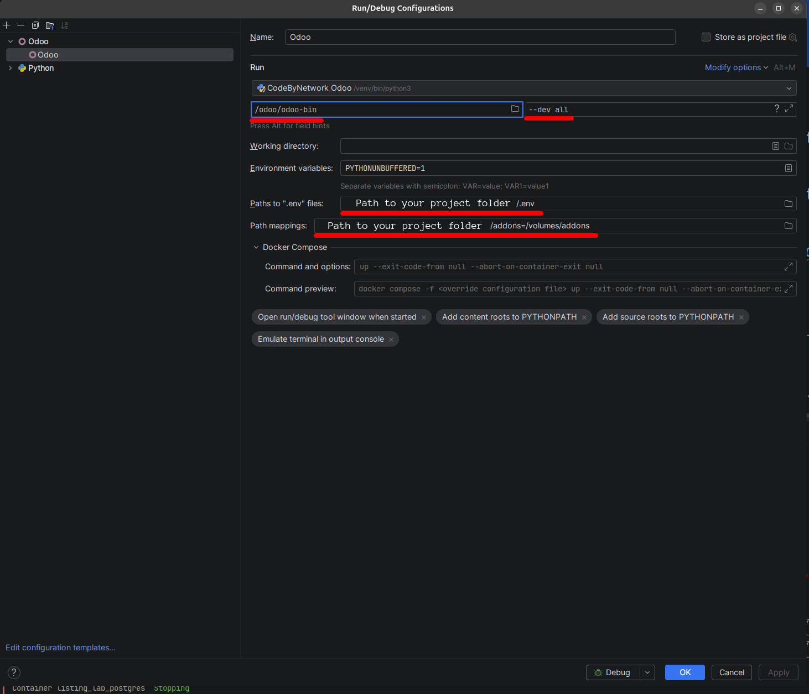

> [!TIP]
> Want to see a project built with this image? 
> Check out [Listing Lab](https://github.com/adomi-io/listing-lab) for a complete example


<p align="center">
    
</p>


# Adomi-io - Odoo

This image is designed for developers, infrastructure teams, and companies that want to deploy 
Odoo on cloud platforms, build SaaS or IaaS products around it, or use Odoo as the foundation 
for their own custom software.

This image exists to turn Odoo into a repeatable, shippable unit.
It allows you to fully own your Odoo deployments. We encourage you to fork this 
repository and customize it to your needs.

Your code, your addons, your config, mounted into this image 
will allow you to build a production-ready image which runs the same on a laptop, 
a staging box, or a cloud cluster, for one customer or a thousand. 

You get a clean development environment that works with modern IDEs, 
supports breakpoints, and mirrors production. Every developer can have their own local
copy of Odoo, and they can be sure their code will run in production exactly the same way
as on their local machine.

When you are ready to deploy, you can push your code with CI/CD to any Docker repository provider,
and the same image goes to your cloud or on-premise deployments, without surprise differences between environments.


> [!NOTE]
> Adomi is an Odoo partner and consulting company. This image serves as a foundation for our open-source Odoo projects.
> We offer custom software development, consulting, tools, and training services built
> for modern software development teams using open-source software and methodologies

> [!WARNING]
> This is not the official Odoo image. This image is a community-maintained Odoo image.
> For those seeking the official image, please visit 
> 
> **[odoo/docker](https://github.com/odoo/docker)**

# Highlights

This image uses `envsubst` with environment variables to dynamically generate your Odoo configuration on the fly. 
This lets you customize your deployments without modifying the base image, streamlining your build process, 
and scaling your instances effortlessly.

- 🔧 [**Dynamic Configuration**](#dynamic-configuration): Generate your Odoo configuration on the fly using `envsubst`, giving you flexible, environment-driven deployments without modifying the base image.
- 📦 [**Easy Enterprise Integration**](#extending-this-image-with-odoo-enterprise): Seamlessly extend the base image to support Odoo Enterprise.
- 🛠️ [**Extensible by Design**](#extending-this-image): Clean extension points make it simple to add custom modules or tailor the image for your stack.
- 🧱 [**Multi-Stage Dockerfile**](./src/Dockerfile): A transparent, well-documented build process powered by a multi-stage Dockerfile.
- 🤖 [**Automated CI/CD Pipeline**](./.github/workflows/docker-publish.yml): Fully automated builds via GitHub Actions keep your image consistent and up-to-date.
- 🧪 [**Robust Unit Testing**](./tests/unit-tests.sh): Open, reliable test coverage ensures your Odoo deployments stay stable.
- 🌙 [**Nightly Upstream Sync**](https://github.com/odoo/odoo): Built nightly from the latest code in the official Odoo GitHub repository, so you're always running the freshest version.

# Getting started

> [!WARNING]
> This application is made to run via Docker.
> You can download Docker Desktop if you are on Windows or Mac
>
>**[Download Docker Desktop](https://www.docker.com/products/docker-desktop/)**

### Docker Compose

This Docker Compose file will launch a copy of Odoo along 
with a Postgres database. Use this to get started.

Copy this file to a folder:

[docker-compose.yml](./docker/docker-compose.yml)

Then run `docker compose up`

```yaml
services:
  odoo:
    image: ghcr.io/adomi-io/odoo:19.0
    restart: unless-stopped 
    ports:
      - "8069:8069"
      - "8072:8072"
    environment:
      # Configure your instances
      ODOO_DB_HOST: ${DB_HOST:-db}
      ODOO_DB_PORT: ${DB_PORT:-5432}
      ODOO_DB_USER: ${DB_USER:-odoo}
      ODOO_DB_PASSWORD: ${DB_PASSWORD:-odoo}
      # Add additional options here, eg:
      # ODOO_WORKERS: ${ODOO_WORKERS:-0}
      # ODOO_MAX_CRON_THREADS: ${ODOO_MAX_CRON_THREADS:-0}
      # ODOO_ADDONS_PATH: /volumes/my-custom-addon-folder
    volumes:
      # Mount your addons
      - ./addons:/volumes/addons
      
      # Persist Odoo Data
      - odoo_data:/volumes/data
      
      # Add enterprise
      # - ./enterprise:/volumes/enterprise
        
      # Mount a custom config
      # - ./src/odoo.conf:/volumes/config/odoo.conf
      
      # Add additional addons like OCA packages or sub-modules
      # - ./sub-modules:/volumes/extra_addons
    depends_on:
      - db
  db:
    image: postgres:13
    container_name: odoo_db
    environment:
      POSTGRES_USER: ${POSTGRES_USER:-odoo}
      POSTGRES_PASSWORD: ${POSTGRES_PASSWORD:-odoo}
      POSTGRES_DB: ${POSTGRES_DATABASE:-postgres}
    volumes:
      - pg_data:/var/lib/postgresql/data
    ports:
      - "5432:5432"
volumes:
  odoo_data:
  pg_data:
```


If you want to always have Odoo running, 
start the image in detached mode by adding the `-d` flag

```shell
docker compose up -d
```

### Docker
This is a simple example of how to run Odoo with Postgres if you are using Docker directly, without Docker Compose.

#### Start an `Odoo` image
```bash
docker run --name odoo \
  -p 8069:8069 \
  -e ODOO_DB_HOST=your-postgres-host \
  -e ODOO_DB_USER=your-postgres-user \
  -e ODOO_DB_PASSWORD=your-postgres-password \
  -e ODOO_DB_PORT=5432 \
  ghcr.io/adomi-io/odoo:19.0
```

> [!TIP]
> If you need a postgres database, you can run the following command to start a postgres container
> ```bash
> docker run -d \
>  --name odoo_db \
>  -e POSTGRES_USER=odoo \
>  -e POSTGRES_PASSWORD=odoo \
>  -e POSTGRES_DB=postgres \
>  -p 5432:5432 \
>  postgres:13
> ``` 

# Update your image

Pull the latest nightly build for your version of Odoo:

```bash
docker pull ghcr.io/adomi-io/odoo:19.0
```

## Supported versions


| Odoo                                               | Pull Command                                 |
|----------------------------------------------------|----------------------------------------------|
| [19.0](https://github.com/adomi-io/odoo/tree/19.0) | ```docker pull ghcr.io/adomi-io/odoo:19.0``` |

# Configure your container
> [!TIP]
> This lets you run multiple different environments (e.g., development, staging, production) with ease.
> For example, you can create a `.env.production` file for production deployments.

> [!TIP]
> If you use Docker BuildKit, you do not need to specify the `env_file` 
> directive in your `docker-compose.yml` file if the file is named `.env`.

Manage your configuration in a `.env` file.

By placing your sensitive data in this file and adding it to your `.gitignore`, 
you keep secrets out of your command line and source code.

## Docker Compose

1. **Create a `.env` file:**  
   Place your `.env` file in the same directory as your `docker-compose.yml` file. 

2. **Reference the env file in your Docker Compose file:**  
   You can explicitly reference the env file using the `env_file` directive:

```yaml
services:
    odoo:
      image: ghcr.io/adomi-io/odoo:19.0
      ports:
        - "8069:8069"
      env_file:
        - .env
```

When you run `docker compose up`, Docker Compose will load the environment variables from the specified file, keeping your configuration tidy and secure.

Using an `.env` file makes it easy to manage environment-specific settings and ensures your sensitive data isn’t hard-coded into your commands or configuration files. 


## Docker

1. **Create a `.env` file:**  
   Define your environment variables in a file named `.env` (or any name you choose). For example:

```env
ODOO_DB_HOST=odoo_db
ODOO_DB_PORT=5432
ODOO_DB_USER=odoo
ODOO_DB_PASSWORD=odoo
```

2. **Run your image using the env file:**  
   Use the `--env-file` flag with `docker run`:

```bash
docker run --name odoo \
 --env-file .env \
 -p 8069:8069 \
 ghcr.io/adomi-io/odoo:19.0
```

This command loads all the variables from your `.env` file into the image.

You can use multiple `.env` files to separate configuration for different environments.

## Using Secret Files

> [!NOTE]
> The file name is case-insensitive inside the image. odoo_db_password and ODOO_DB_PASSWORD are equivalent.

Keep your sensitive data secure by mounting secret files into `/run/secrets/`. 

Create a file named after the environment variable you want to set. 

For example, to set `ODOO_DB_PASSWORD`, create a file named `ODOO_DB_PASSWORD` containing your password

This approach lets you securely load any configuration option from a file.

### Docker Compose
Docker Compose supports secret files natively. Create a file (e.g., `odoo_db_password`) and reference it in your `docker-compose.yml`:

```yaml
services:
  odoo:
    image: ghcr.io/adomi-io/odoo:19.0
    ports:
      - "8069:8069"
    environment:
      ODOO_DB_HOST: ${DB_HOST:-db}
      ODOO_DB_PORT: ${DB_PORT:-5432}
      ODOO_DB_USER: ${DB_USER:-odoo}
      # ODOO_DB_PASSWORD will be loaded from the secret file
      # ODOO_DB_PASSWORD: ${DB_PASSWORD:-odoo}
    secrets:
      - odoo_db_password

secrets:
  odoo_db_password:
    file: odoo_db_password.txt
```

### Docker
Mount your secret file with the `-v` flag:

```bash
docker run --name odoo \
  -p 8069:8069 \
  -e ODOO_DB_HOST=odoo_db \
  -v $(pwd)/ODOO_DB_PASSWORD:/run/secrets/ODOO_DB_PASSWORD \
  -e ODOO_DB_PASSWORD=odoo \
  ghcr.io/adomi-io/odoo:19.0
```

# Logging into container

Need to jump into your image like you would via SSH? With Docker Compose, it's as simple as:

```shell
docker compose exec odoo /bin/bash
```

This command drops you right into the image's shell for quick debugging or tweaks.

# Extending This Image

> [!TIP]
> Want to see a project which extends with this image? 
> Check out [Listing Lab](https://github.com/adomi-io/listing-lab) for a complete example

Customize your own image by setting default environment variables,
baking your Odoo config, and adding your custom addons. 
You can even pre-build an image with Odoo Enterprise!

### Create a Custom Dockerfile

In your project's root, create a file named `Dockerfile`:

```dockerfile
FROM ghcr.io/adomi-io/odoo:19.0

# Install Python dependenies
# USER root
# RUN pip install stripe
# RUN pip install -r requirements.txt
# USER 1000

# Optionally copy your custom config file
# COPY odoo.conf /volumes/config/odoo.conf

# Copy your custom addons into the image
COPY . /volumes/addons
```

Instead of using the `image` tag in your `docker-compose.yml`, 
switch to a `build` context. For example, replace:

```yaml
services:
  odoo:
    image: ghcr.io/adomi-io/odoo:19.0
    # ...
```

with:

```yaml
services:
  odoo:
    build:
      context: .
      dockerfile: Dockerfile
    # ...
```

Then build and start your image with:

```sh
docker compose build && docker compose up
```

### Python

A virtual environment is already set up at `/venv` inside the image, with Odoo and its dependencies installed. 
This means you can run Python commands as usual:

```dockerfile
RUN pip install stripe
RUN pip install -r requirements.txt
RUN python myapp.py
```

This lets you easily extend and customize the image to fit your development needs. 

# Extending This Image with Odoo Enterprise

## Odoo Partners

If you're an Odoo Partner (or have GitHub access), extending your image is a breeze. 
First, clone the Enterprise repository into your project's root:

```bash
git clone git@github.com:odoo/enterprise.git
```

Then, create a `Dockerfile` in your project with the following content:

```dockerfile
FROM ghcr.io/adomi-io/odoo:19.0

# Copy the Enterprise addons into the folder located at /volumes/enterprise
COPY ./enterprise /volumes/enterprise
```

Finally, build and run your image:

```sh
docker compose up --build
```

## Downloaded Enterprise 

If you're not an Odoo Partner but have a valid Enterprise license, you can download Enterprise from [Odoo Downloads](https://www.odoo.com/page/download).

1. **Download:** Grab the Enterprise file from the "Sources" row.
2. **Extract & Rename:** Extract the file, navigate to the `/odoo` directory, and rename the `addons` folder to `enterprise`.
3. **Copy:** Move the renamed `enterprise` folder to the top level of your project.

Create a `Dockerfile` with the following content:

```dockerfile
FROM ghcr.io/adomi-io/odoo:19.0

# Copy the Enterprise addons into the folder located at /volumes/enterprise
COPY ./enterprise /volumes/enterprise
```

Then, build and run your image:

```sh
docker compose up --build
```

## Extra Addons

You may have extra addons which you just want to use, not develop for. 

Rather than force you to put external packages or submodules
in your `addons` folder, which can get overwhelming in larger projects, 
this image has an optional volume at `/volumes/extra_addons`.

If there is a directory loaded to `/volumes/extra_addons`, the entrypoint script will automatically add it 
to the Odoo addons path.

```dockerfile
FROM ghcr.io/adomi-io/odoo:19.0

# Copy your submodules and external addons into the folder located at /volumes/extra_addons
COPY ./oca/addons /volumes/extra_addons
```

# Dynamic Configuration

> [!NOTE]
> This Docker image uses `envsubst` to generate an `odoo.conf` file based on your environment variables. 
> This means you can configure Odoo at every stage of the image's lifecycle. Build values into your image, 
> set them at runtime via a mounted file, or pass them through environment variables in your cloud provider's UI.

> [!TIP]
> You can enable any configuration option to be driven by environment variables by uncommenting it in the [`odoo.conf`](./src/odoo.conf) file.

## Default Odoo Configuration File

This image includes a default Odoo configuration that you can override, modify, or hardcode as needed.

The configuration file is located [here](./src/odoo.conf) and is stored in the image at `/volumes/config/odoo.conf`.

Some options, when set, change Odoo’s default behavior. To keep things flexible, many supported options are included in the entrypoint and Dockerfile but are commented out by default.

To see a complete list of options, review the default configuration file and simply uncomment the features you want to enable. You can mount the `odoo.conf` file at runtime or bake it into the image by extending it (see [Extending this image](#extending-this-image)).

The following options are enabled by default and can be set via environment variables:

```ini
[options]
# specify the database user name (default: False)
db_user = $ODOO_DB_USER

# specify the database password (default: False)
db_password = $ODOO_DB_PASSWORD

# specify the database host (default: False)
db_host = $ODOO_DB_HOST

# specify the database name (default: False)
db_name = $ODOO_DB_NAME

# specify the database port (default: False)
db_port = $ODOO_DB_PORT

# Comma-separated list of server-wide modules. (default: base,web)
server_wide_modules = $ODOO_SERVER_WIDE_MODULES

# Directory where to store Odoo data (default: /var/lib/odoo)
data_dir = $ODOO_DATA_DIR

# specify additional addons paths (separated by commas). (default: None)
addons_path = $ODOO_ADDONS_PATH

# disable loading demo data for modules to be installed (comma-separated, use "all" for all modules). Requires -d and -i. Default is %default (default: False)
without_demo = $ODOO_WITHOUT_DEMO

# Activate reverse proxy WSGI wrappers (headers rewriting). Only enable this when running behind a trusted web proxy! (default: False)
proxy_mode = $ODOO_PROXY_MODE

# Specify the number of workers, 0 disable prefork mode. (default: 0)
workers = $ODOO_WORKERS

# Maximum allowed virtual memory per worker (in bytes), when reached the worker will be reset after the current request (default 2048MiB). (default: 2147483648)
limit_memory_soft = $ODOO_LIMIT_MEMORY_SOFT

# Maximum allowed virtual memory per worker (in bytes), when reached, any memory allocation will fail (default 2560MiB). (default: 2684354560)
limit_memory_hard = $ODOO_LIMIT_MEMORY_HARD

# Maximum allowed CPU time per request (default 60). (default: 60)
limit_time_cpu = $ODOO_LIMIT_TIME_CPU

# Maximum allowed Real time per request (default 120). (default: 120)
limit_time_real = $ODOO_LIMIT_TIME_REAL
```

# Overriding configuration options at runtime

## Docker Compose

You can also set these options in your `docker-compose.yml` file:

```yaml
services:
  odoo:
    image: ghcr.io/adomi-io/odoo:19.0
    ports:
      - "8069:8069"
    environment:
      ODOO_DB_HOST: ${ODOO_DB_HOST:-db}
      ODOO_DB_PORT: ${ODOO_DB_PORT:-5432}
      ODOO_DB_USER: ${ODOO_DB_USER:-odoo}
      ODOO_DB_PASSWORD: ${ODOO_DB_PASSWORD:-odoo}
      # For example, setting the number of workers:
      ODOO_WORKERS: 5
```

## Docker

Simply set the configuration options using the `-e` flag, prefixing the option name with `ODOO_`. For example, to set the number of workers:

```shell
docker run --name odoo \
  -p 8069:8069 \
  -e ODOO_DB_HOST=odoo_db \
  -e ODOO_DB_PORT=5432 \
  -e ODOO_DB_USER=odoo \
  -e ODOO_DB_PASSWORD=odoo \
  -e ODOO_WORKERS=5 \
  ghcr.io/adomi-io/odoo:19.0
```

# Create your own dynamic `odoo.conf`

## Step 1: Create an `odoo.conf` File

Create a file in your project's folder called `odoo.conf`. We typically store these in a folder called `config`

We recommend copying the [default odoo.conf file provided with this image](./src/odoo.conf)
and then modifying it with the values you want to use.

For example:

```ini
[options]
# Hard-code a value by entering the config name
db_host = my-hardcoded-database.abc-corp.com
workers = 2

# Defer to the environment variable by using the name of the config prefixed with ODOO_
db_port = $ODOO_DB_PORT
db_user = $ODOO_DB_USER
db_password = $ODOO_DB_PASSWORD
addons_path = $ODOO_ADDONS_PATH
data_dir = $ODOO_DATA_DIR
```

## Step 2: Mount the Configuration File

## Docker Compose

To use your custom configuration file with Docker Compose, update your `docker-compose.yml` to mount it at `/volumes/config/odoo.conf`:

```yaml
services:
  odoo:
    image: ghcr.io/adomi-io/odoo:19.0
    # ...
    volumes:
      - ./config/odoo.conf:/volumes/config/odoo.conf # Add this to your docker compose configuration
```

### Docker

Add the `-v $(pwd)/config/odoo.conf:/volumes/config/odoo.conf` flag to your `docker run` command. For example:

```shell
docker run -d \
  --name odoo \
  -p 8069:8069 \
  -v $(pwd)/odoo.conf:/volumes/config/odoo.conf \
  ghcr.io/adomi-io/odoo:19.0
```

## Environment Variable Defaults

The Dockerfile is built with a set of default environment variables. If you do not override these variables when deploying 
your Odoo image, the defaults will be used. For more details, check the [Dockerfile](./src/Dockerfile).

```dockerfile
ENV ODOO_CONFIG="/volumes/config/_generated.conf" \
    ODOO_ADDONS_PATH="/odoo/addons,/volumes/addons" \
    ODOO_GEOIP_CITY_DB="/usr/share/GeoIP/GeoLite2-City.mmdb" \
    ODOO_GEOIP_COUNTRY_DB="/usr/share/GeoIP/GeoLite2-Country.mmdb" \
    SSL_CERT_FILE=/etc/ssl/certs/ca-certificates.crt
```

## Building Default Configuration into the Image

You can set the default values for the environment variables at build-time.

Copy the [odoo.conf](./src/odoo.conf) file, then uncomment or set the configuration options you’d like to support.

Setting the default with `ENV` will set that value if no environment variable is passed into the image. This lets you define defaults and override them later via environment variables or your cloud provider's UI at runtime.

```dockerfile
FROM ghcr.io/adomi-io/odoo:19.0

# Copy your config into the image
COPY odoo.conf /volumes/config/odoo.conf

# Set the default value for subsequent images.
# Specifying ODOO_WORKERS in the environment will now override this value;
# if ODOO_WORKERS is not set, it will default to 5.
ENV ODOO_WORKERS=5
```

# Setup Hook
> [!TIP]
> This feature is useful for automatically installing apps when the container first starts
>
> [**See our example hook_setup.sh script**](https://github.com/adomi-io/listing-lab/blob/master/hooks/hook_setup.sh) from [**Listing Lab**](https://github.com/adomi-io/listing-lab/tree/master)

> [!NOTE]
> This script runs even if you’re using the image as a command-line
> utility (e.g., `scaffold`) and executes before the `wait-for-psql`
> script, so it doesn't guarantee that the database is reachable.

When the image starts, it processes all the environment variables and their defaults to generate a `_generated.conf` file. 

Once that's done, but before Odoo launches, the entrypoint invokes a script located at `/hook_setup`.

Use this hook to run any custom bash commands right before Odoo starts up. 

Mount your script to `/hook_setup`.

# Development with this image

You can use this image as a development environment and debug and test your code. 
This assumes you have the [PyCharm Odoo](https://plugins.jetbrains.com/plugin/13499-odoo) plugin by Trịnh Anh Ngọc. 

If you dont already have it, consider it, its excellent!

> [!NOTE]
> Expand this section for detailed instructions on how to use this image with your IDE

<details><summary>Use this image as a development environment w/ Breakpoints</summary>

## Docker Compose

Follow the [Docker Compose](#docker-compose) setup. This will mount your `./addons` folder into the image so that your changes are reflected immediately in Odoo.

> [!NOTE] 
> For certain changes (e.g., UI updates), you'll need to go to `Apps` and update your app.

You can also use the virtual environment (`venv`) inside the image for debugging and setting breakpoints in PyCharm.

## Adding the venv as an Interpreter in PyCharm

1. Go to **File → Settings → Project → Python Interpreter**.
2. Click **Add Interpreter** and select **On Docker Compose**.

   

3. Choose `odoo` as the service.

   

4. Select the Python interpreter located in the `/venv` folder.

   

5. Click **Create**.


## Adding a Debug Configuration

1. Click the targets and edit the current configurations.

   

2. Click **Add** in the top left and select an **Odoo** run configuration.

   

3. Set the interpreter to the one you just set up. The `odoo-bin` file is located at `/odoo/odoo-bin`.

4. Add the path mapping from `./addons` to `/volumes/addons`.

5. Click **OK**, then click the **Debug** button. You can now set breakpoints and debug your code.
</details>

## Debugging the Generated Config

The `odoo.conf` file is processed through `envsubst` and output to `/volumes/config/_generated.conf`. If you need to inspect the final configuration, mount the `/volumes/config` folder to your host.

For example, move your config file to `./config/odoo.conf` in your project, then update your Docker Compose configuration to mount the `./config` folder:

```yaml
services:
  odoo:
    image: ghcr.io/adomi-io/odoo:19.0
    # ...
    volumes:
      - ./config:/volumes/config # This mounts your config folder into the image
```

When the image starts, a `_generated.conf` file will appear in the `./config` folder, 
showing the final configuration used by Odoo.


# Maintaining This Repository

## Adding a New Version of Odoo

When Odoo launches a new version, they publish the changes on its own branch. This repository mirrors the Odoo version branch names.

When a new version is released, create a branch in this repository with the same name as the Odoo branch you wish to track.

Then, add the branch name to the [docker-publish.yml](./.github/workflows/docker-publish.yml) file under the `strategy/matrix/branch` section.

The resulting image will be automatically built, unit-tested, deployed, and scheduled for nightly builds.

## Testing

### Unit Tests

The testing script is located in [./tests/unit-tests.sh](./tests/unit-tests.sh).

This script will create a Postgres database, install all selected Odoo addons, and run the corresponding unit tests.

To run these tests, clone the repository:

```sh
git clone git@github.com:adomi-io/odoo.git
```

Then, navigate to the `tests` folder:

```sh
cd odoo/tests
```

Finally, run the unit test script:

```sh
./tests/unit-tests.sh
```

# License

For license details, see the [LICENSE](https://github.com/adomi-io/odoo/blob/master/LICENSE) file in the repository.

